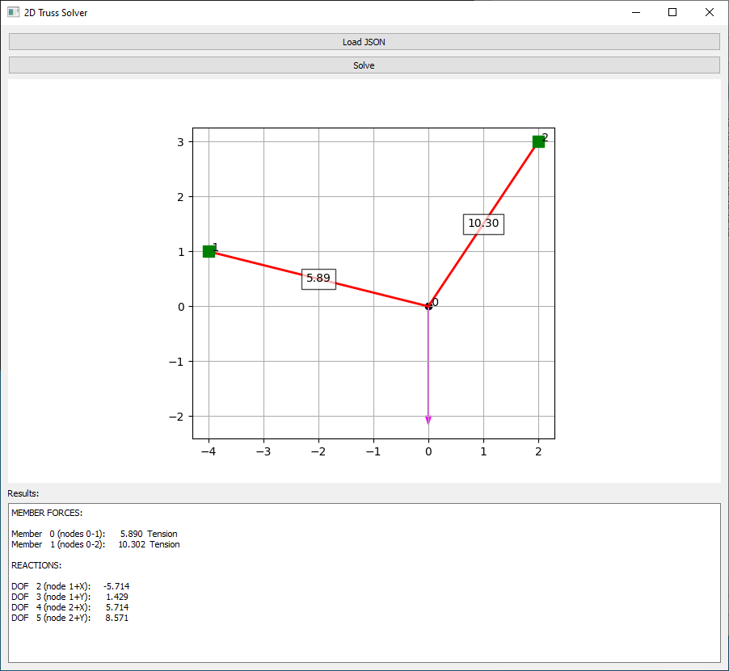
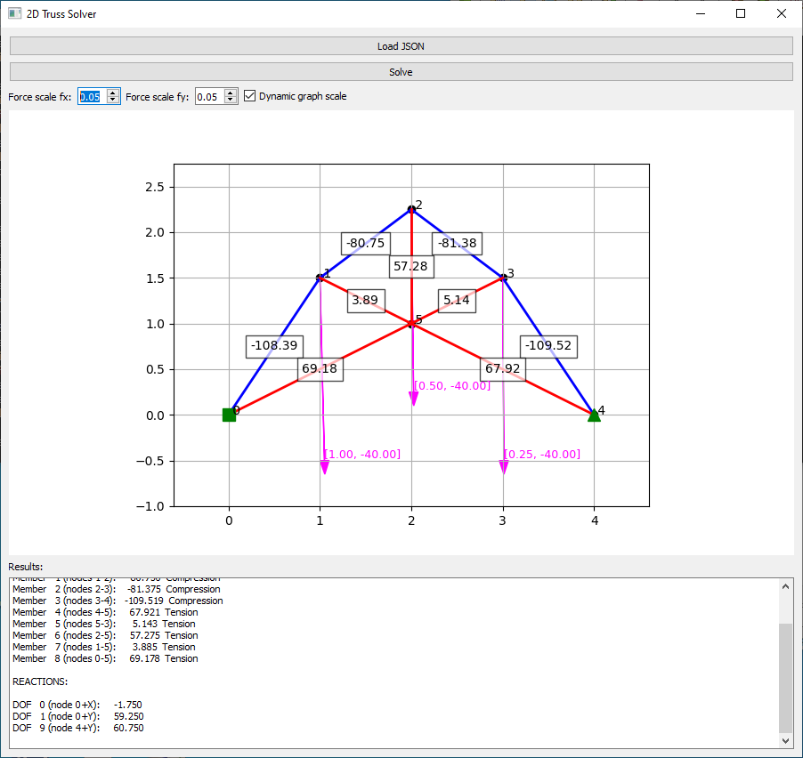

# Truss2D
GUI solver of 2D truss structure

<p align="center">
  
  
  
</p>

## Quick start

If [git](https://git-scm.com/) and [Python](https://www.python.org/) are installed, then:

```bash
git clone https://github.com/xvokac/Truss2D
cd Truss2D
pip install numpy matplotlib PyQt5
python truss_gui.py
```
