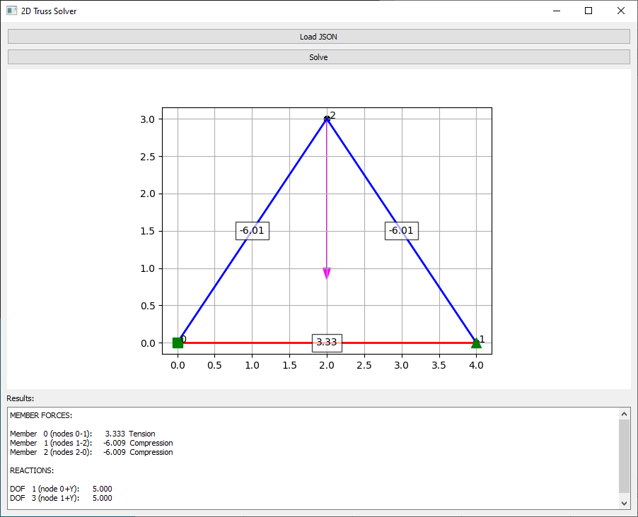

# Truss2D
GUI solver of 2D truss structure


## Quick start

Jestliže je instalován [git](https://git-scm.com/) a [Python](https://www.python.org/), potom:

```bash
git clone https://github.com/xvokac/Truss2D
cd Truss2D
pip install numpy matplotlib PyQt5
python truss_gui.py
```
